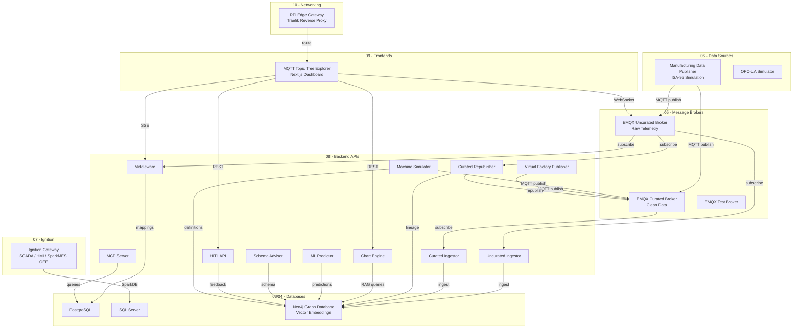
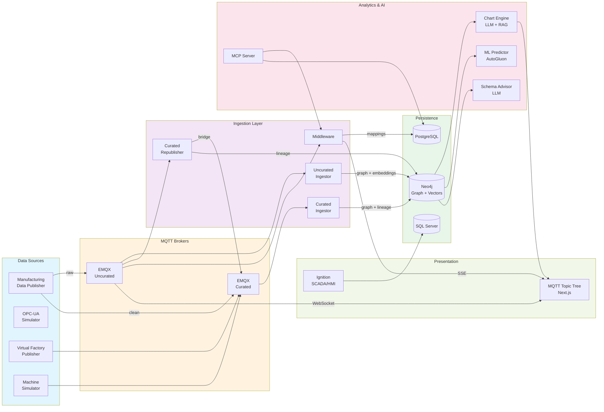
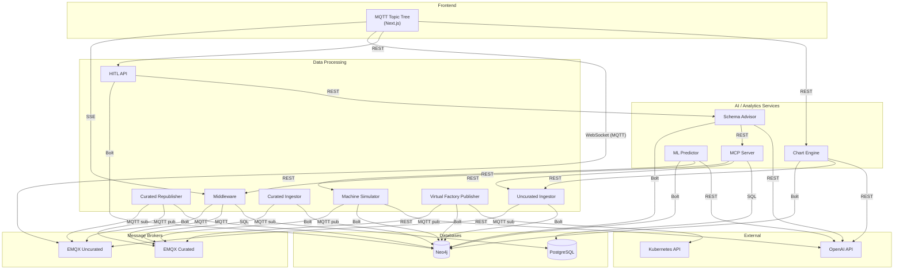
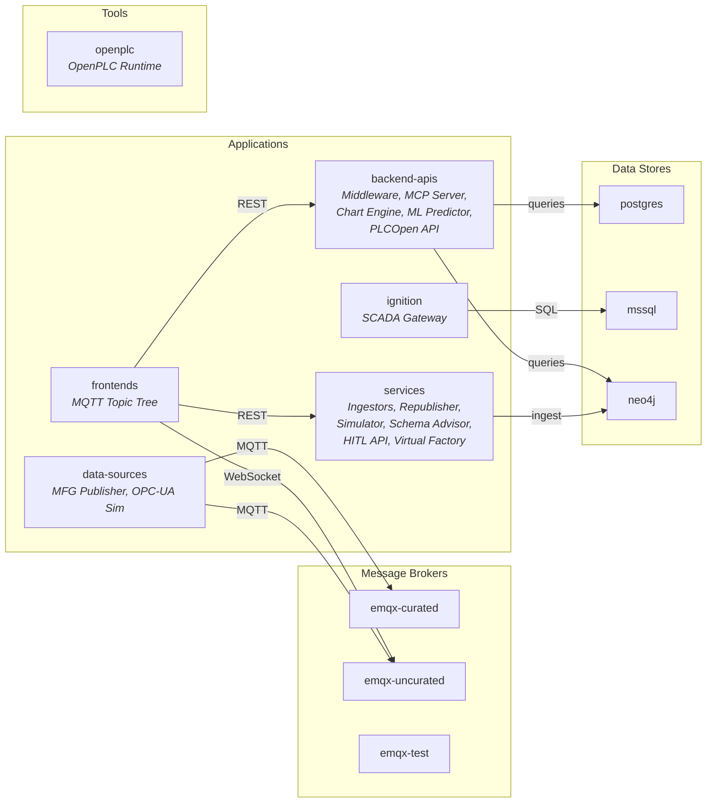

# Unified Namespace (UNS) Industrial IoT Platform

A Kubernetes-based industrial data platform that combines real-time MQTT telemetry, graph-based knowledge storage, LLM-powered analytics, and OEE tracking into a unified namespace architecture for smart manufacturing.

## Architecture Overview



## Directory Structure

```
kubernetes/dev/
├── 01-namespaces/              # Kubernetes namespace definitions
├── 02-storage/                 # Persistent volume configurations
├── 03-databases/               # Relational databases
│   ├── postgres/               #   PostgreSQL - topic mappings, middleware state
│   ├── mssql/                  #   SQL Server - SparkMES OEE, production data
│   └── timescaledb/            #   TimescaleDB (testing)
├── 04-graph-database/          # Knowledge graph
│   └── neo4j/                  #   Neo4j Enterprise - topic hierarchy, embeddings, lineage
├── 05-message-brokers/         # MQTT message infrastructure
│   ├── emqx-curated/           #   EMQX broker for validated/curated data
│   ├── emqx-uncurated/         #   EMQX broker for raw telemetry
│   └── emqx-test/              #   EMQX broker for development/testing
├── 06-data-sources/            # Data generation and simulation
│   ├── manufacturing-data-publisher/  # ISA-95 hierarchy simulator (100 machines, 50 systems)
│   └── opc-ua-simulator/       #   OPC-UA industrial equipment simulator
├── 07-ignition/                # Industrial automation platform
│   └── gateway-primary/        #   Ignition SCADA gateway with SparkMES OEE scripts
├── 08-backend-apis/            # Backend microservices
│   ├── middleware/              #   MQTT topic mapping and transformation (FastAPI)
│   ├── mcp-server/             #   Model Context Protocol server for AI tooling
│   ├── chart-engine/           #   LLM-powered chart generation with RAG
│   ├── ml-predictor/           #   Time-series forecasting and anomaly detection
│   ├── machine-simulator/      #   Simulated machine management and MQTT publishing
│   ├── schema-advisor/         #   LLM-powered schema recommendations
│   ├── hitl-api/               #   Human-in-the-loop feedback API
│   ├── curated-republisher/    #   Uncurated → curated broker bridge
│   ├── curated-ingestor/       #   Curated MQTT → Neo4j ingestion
│   ├── uncurated-ingestor/     #   Raw MQTT → Neo4j ingestion with embeddings
│   └── virtual-factory-publisher/  # Kubernetes cluster metrics → MQTT
├── 09-frontends/               # Web applications
│   └── mqtt-topic-tree/        #   Real-time MQTT topic explorer (Next.js)
├── 10-networking/              # Edge networking
│   └── rpi-gateway/            #   Raspberry Pi Traefik gateway config
└── 11-tools/                   # Specialized tooling
    └── plcopen-editor/         #   IEC 61131-3 PLC programming tools
        ├── openplc-runtime/    #     OpenPLC execution runtime
        └── plcopen-api/        #     REST API for PLCOpen programs
```

## Data Flow



## Component Descriptions

### Databases (03-04)

| Component | Purpose |
|-----------|---------|
| **PostgreSQL** | Stores MQTT topic mappings, middleware state, and MCP server data |
| **SQL Server** | SparkMES production data, OEE calculations, product orders, and location hierarchy |
| **Neo4j** | Graph database storing the MQTT topic tree hierarchy, message history, schema mappings, and 384-dimension vector embeddings for semantic search |

### Message Brokers (05)

The platform uses a **dual-broker architecture** with EMQX:

| Broker | Purpose |
|--------|---------|
| **Uncurated** | Receives raw, high-frequency telemetry from all data sources. Ingestors and the republisher subscribe here. |
| **Curated** | Contains validated, transformed data. The republisher bridges selected topics from uncurated to curated. |
| **Test** | Isolated broker for development and testing with no ACL restrictions. |

All brokers use a rule engine that republishes incoming messages to an `$ingest/` prefix topic, enabling ingestors to process data without affecting the main topic tree.

### Data Sources (06)

| Component | Purpose |
|-----------|---------|
| **Manufacturing Data Publisher** | Simulates 100 industrial machines (CNC, robots, conveyors, welders, presses, AGVs) and 50 enterprise systems (ERP, MES, SCADA, DCS, WMS) following ISA-95 hierarchy |
| **OPC-UA Simulator** | Simulates OPC-UA industrial equipment endpoints |

### Ignition Gateway (07)

The Ignition SCADA gateway provides traditional industrial monitoring and integrates with **SparkMES** for OEE (Overall Equipment Effectiveness) tracking. The gateway tag change script automatically:
- Detects new machines from MQTT `PartCode` tags
- Registers them in the SparkDB location hierarchy
- Creates CounterOEE UDT instances for automated OEE calculation
- Maps machine states (Running, Paused, E-Stop, etc.) to OEE event classifications
- Syncs per-machine run rates and starts product orders

### Backend APIs (08)

| Service | Purpose |
|---------|---------|
| **Middleware** | Real-time MQTT topic mapping and transformation. Provides SSE streams to the frontend. |
| **MCP Server** | Model Context Protocol server exposing middleware and ingestor capabilities as AI tools (for Claude, etc.) |
| **Chart Engine** | Generates data visualizations from natural language queries using RAG over the Neo4j knowledge graph |
| **ML Predictor** | Time-series forecasting and anomaly detection using AutoGluon. Retrains models periodically. |
| **Machine Simulator** | Creates and manages simulated machines. Generates machine descriptions and ladder logic via LLM. |
| **Schema Advisor** | LLM-powered recommendations for MQTT topic schema design and data structure improvements |
| **HITL API** | Human-in-the-loop API for user feedback, data annotation, and topic mapping approvals |
| **Curated Republisher** | Bridges messages from the uncurated broker to the curated broker with transformation and lineage tracking |
| **Uncurated Ingestor** | Consumes raw MQTT messages, generates vector embeddings (MiniLM-L6-v2), and persists to Neo4j |
| **Curated Ingestor** | Consumes curated MQTT messages and persists to Neo4j with lineage metadata |
| **Virtual Factory Publisher** | Reads Kubernetes cluster metrics and publishes them as MQTT topics under a VirtualFactory namespace |

### Frontends (09)

| Component | Purpose |
|-----------|---------|
| **MQTT Topic Tree** | Next.js real-time dashboard for exploring the MQTT topic hierarchy, inspecting messages, visualizing the knowledge graph, and generating charts via natural language |

### Networking (10)

| Component | Purpose |
|-----------|---------|
| **RPi Gateway** | Traefik-based reverse proxy for edge deployment on Raspberry Pi. Implements a restricted routing policy — only whitelisted API routes are exposed. |

### Tools (11)

| Component | Purpose |
|-----------|---------|
| **OpenPLC Runtime** | IEC 61131-3 PLC program execution runtime with Modbus TCP support |
| **PLCOpen API** | REST API for PLCOpen/IEC 61131-3 XML schema validation and PLC program management |

## Service Interactions



## Key Design Patterns

### Dual MQTT Broker (Uncurated / Curated)
Raw telemetry flows into the **uncurated** broker without filtering. The **curated republisher** selectively bridges validated messages to the **curated** broker after transformation. This separation keeps noisy raw data isolated from clean, production-quality data streams.

### ISA-95 Topic Hierarchy
MQTT topics follow the ISA-95 standard: `enterprise/site/area/line/cell/asset/metric`. The Manufacturing Data Publisher simulates this hierarchy, and the Neo4j graph database models it as a navigable tree structure.

### Message-to-Graph Pipeline
Every MQTT message is ingested into Neo4j as a graph node with relationships to its topic path segments. The uncurated ingestor generates 384-dimensional vector embeddings (MiniLM-L6-v2) for each topic, enabling semantic similarity search across the topic namespace.

### LLM-Native Analytics
Multiple services integrate with LLMs for intelligent data processing:
- **Chart Engine** uses RAG (Retrieval-Augmented Generation) to find relevant topics in Neo4j before generating visualizations
- **ML Predictor** uses AutoGluon for time-series forecasting with LLM-assisted interpretation
- **Schema Advisor** provides data structure recommendations through multi-turn conversations
- **Machine Simulator** generates machine descriptions and ladder logic

### Model Context Protocol (MCP)
The MCP Server exposes middleware and ingestor capabilities as standardized AI tools, enabling AI assistants (like Claude) to interact with the platform's data through tool use.

### Edge Gateway Security
The Raspberry Pi gateway uses Traefik with an explicit allowlist — only specific API routes are exposed to the edge network. Administrative and write-heavy endpoints are blocked by default.

## Technology Stack

| Layer | Technologies |
|-------|-------------|
| **Orchestration** | Kubernetes (k3s) |
| **Message Broker** | EMQX (MQTT, WebSocket, TLS) |
| **Graph Database** | Neo4j Enterprise (Bolt, APOC, Vector Indexes) |
| **Relational DB** | PostgreSQL, Microsoft SQL Server |
| **Backend** | Python, FastAPI, aiohttp, asyncio |
| **ML/AI** | AutoGluon, sentence-transformers, scikit-learn, OpenAI API |
| **Frontend** | Next.js, React, TypeScript, Tailwind CSS, Chart.js |
| **SCADA/HMI** | Inductive Automation Ignition, SparkMES |
| **PLC** | OpenPLC Runtime, IEC 61131-3 / PLCOpen XML |
| **Edge Networking** | Traefik, Tailscale |
| **Protocols** | MQTT, OPC-UA, Modbus TCP, SSE, WebSocket, MCP |
| **Containerization** | Docker, local registry |

## Namespace Organization



## Getting Started

### Prerequisites
- Kubernetes cluster (k3s recommended)
- Local Docker registry
- `kubectl` and `docker` CLI tools

### Build and Deploy Workflow

**Frontend applications** (Next.js):
```bash
cd dev/09-frontends/<app-name>
npm run build
docker build -t <app-name>:latest .
docker tag <app-name>:latest localhost:5000/<app-name>:latest
docker push localhost:5000/<app-name>:latest
kubectl rollout restart deployment/<app-name> -n frontends
```

**Backend APIs** (Python):
```bash
cd dev/08-backend-apis/<app-name>
docker build -t <app-name>:latest .
docker tag <app-name>:latest localhost:5000/<app-name>:latest
docker push localhost:5000/<app-name>:latest
kubectl rollout restart deployment/<app-name> -n backend-apis
```

### Useful Commands
```bash
# Check deployment status
kubectl get pods -n <namespace>

# View logs
kubectl logs -f deployment/<app-name> -n <namespace>

# Check all deployments
kubectl get deployments --all-namespaces
```

## License

This project is licensed under the MIT License — see the [LICENSE](LICENSE) file for details.
